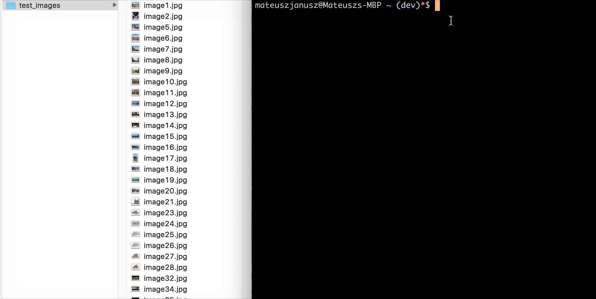

# picsort 📸
Organize JPG/JPEG photos into folders by date through the command line. 


It uses [node-exif](https://github.com/gomfunkel/node-exif) to extract the created date from an image. If the exif data is not available, picsort will try to extract the created date from the filename, otherwise it will remain in the original location.

## Demo



## Install
Remember to install the package globally. 🌎 <br><br>
If you are using npm, add `-g`

```
$ npm install -g picsort
```


If you are using yarn, add `global` just after `yarn` 
```
$ yarn global add picsort
```

## Usage
To sort your photos simply type `picsort` followed by the path to the source directory. 
```
$ picsort ./Desktop/images
```
**Tip:** You can also drag and drop folders! (see the demo)

To see all options or an usage example in command line, add flag `-h` or `--help`
```
$ picsort -h
$ picsort --help
```

## Options
Picsort will sort your photos in Year/Month order by default. However, you can specify sorting precision by adding a flag. <br>

Use flag `-d` to sort photos by **Year/Month/Day/**. <br>
```
$ picsort [path] -d
````

Use flag `-m` to sort photos by **Year/Month/**. This is the default option.<br> 
```
$ picsort [path] -m
````

Use flag `-y` to sort photos by **Year/**. <br>
```
$ picsort [path] -y
````

## Changelog
- **17/10/17** version 0.1.0 released.

## License

MIT License

Copyright (c) 2017 Mateusz Janusz

Permission is hereby granted, free of charge, to any person obtaining a copy of this software and associated documentation files (the "Software"), to deal in the Software without restriction, including without limitation the rights to use, copy, modify, merge, publish, distribute, sublicense, and/or sell copies of the Software, and to permit persons to whom the Software is furnished to do so, subject to the following conditions:

The above copyright notice and this permission notice shall be included in all copies or substantial portions of the Software.

THE SOFTWARE IS PROVIDED "AS IS", WITHOUT WARRANTY OF ANY KIND, EXPRESS OR IMPLIED, INCLUDING BUT NOT LIMITED TO THE WARRANTIES OF MERCHANTABILITY, FITNESS FOR A PARTICULAR PURPOSE AND NONINFRINGEMENT. IN NO EVENT SHALL THE AUTHORS OR COPYRIGHT HOLDERS BE LIABLE FOR ANY CLAIM, DAMAGES OR OTHER LIABILITY, WHETHER IN AN ACTION OF CONTRACT, TORT OR OTHERWISE, ARISING FROM, OUT OF OR IN CONNECTION WITH THE SOFTWARE OR THE USE OR OTHER DEALINGS IN THE SOFTWARE.
